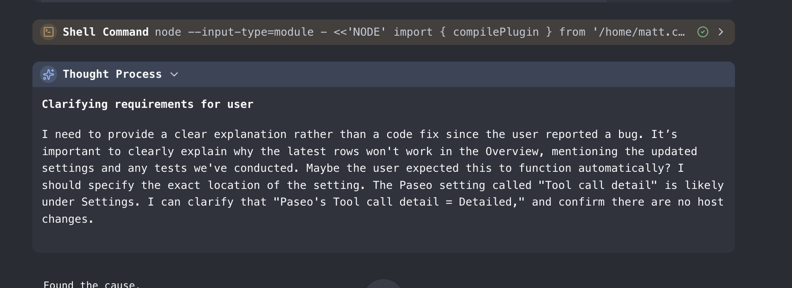
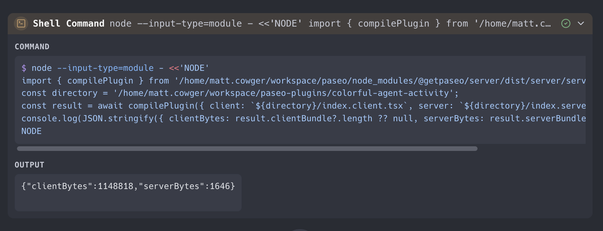
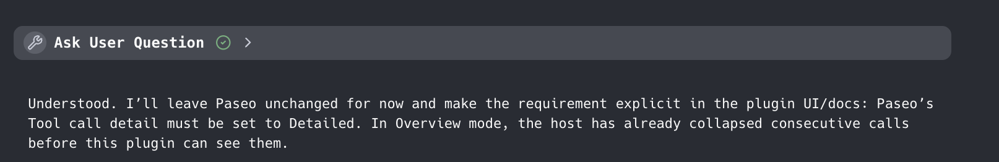
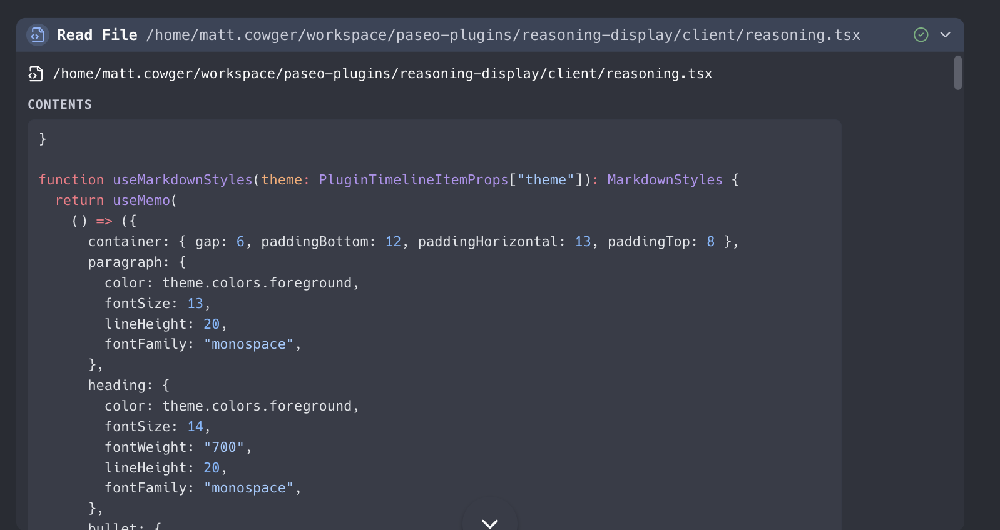

# Colorful agent activity

Colorful agent activity replaces Paseo's public reasoning and agent tool-call rows with compact,
icon-led cards. It keeps the latest thinking block and latest tool call open, shows useful details on
demand, and uses Shiki for shell and code output.

Requires Paseo `>=0.8.0`.

## Screenshots

Thought process and shell activity:



Expanded shell command with command/output sections:



Interactive agent question row:



Expanded file read with syntax-highlighted content:



Paseo tool calls use purpose-built cards with readable prompt, configuration, result, and status sections:


## Features

- Color-coded reasoning and tool-call cards with Lucide icons.
- Markdown reasoning support for headings, inline bold/italic/code, ordered and unordered lists,
  blockquotes, blank-line spacing, and fenced code blocks.
- The newest thinking block stays open until a newer thinking block starts, including while tools run.
- The newest tool call stays open until a newer tool call appears.
- Shell commands and terminal output highlighted with Shiki.
- Extension-aware file icons for reads, writes, edits, and search results.
- Edit statistics such as `+8 / -0` with colored diff rows.
- Detail views for shell, read, write, edit, search, fetch, worktree, sub-agent, plan, plain-text,
  and unknown tool payloads.
- Vivid, soft, and high-contrast palette modes using the active Paseo theme.
- Status indicators for running, completed, failed, and canceled calls.
- Specialized Paseo cards for agents, workspaces, terminals, schedules, providers, permissions, and browser automation instead of raw JSON.

## Install

From the public repository:

```bash
paseo plugin add mcowger/paseo-plugins:colorful-agent-activity
```

For a local checkout:

```bash
cd /absolute/path/to/paseo-plugins/colorful-agent-activity
npm install --legacy-peer-deps
npm run typecheck
npm test
paseo plugin install "$PWD"
```

## Setup

Disable `reasoning-display` while this plugin is enabled. Paseo gives the first matching timeline
transformer ownership of a source row.

Set Paseo's **Tool call detail** setting to **Detailed**. In Overview mode, Paseo groups consecutive
tool calls before plugin transforms run, so the plugin cannot recover each individual call.

Choose a palette under the plugin's **Colorful activity** settings screen:

- **Vivid** — stronger category colors and tinted surfaces.
- **Soft** — quieter accents and backgrounds.
- **High contrast** — stronger borders and status colors.

Reload after installation or source changes:

```bash
paseo plugin reload colorful-agent-activity
```

## Limitations

- The plugin sees public agent tool calls, not internal orchestrator calls.
- Detailed tool-call mode is required for one card per tool call.
- Paseo's native detail and syntax components are private, so this plugin renders its own details.
- Shiki uses its JavaScript regex engine in the plugin bundle. It is not a terminal emulator.
- Unsupported or oversized output falls back to plain monospace text.
- Unknown provider payloads use a generic JSON fallback.
- A transformer that claims the same source row in another plugin can win before this plugin runs.
- Disable `reasoning-display` when using this plugin because both transform reasoning rows.

## Development

```bash
npm run lint
npm run typecheck
npm test
```

The plugin uses separate Paseo v0.8 client and server entries. The server entry only registers the
host-scoped palette settings; timeline rendering runs in the client bundle.

## paseo.cafe submission

The registry entry belongs in the separate `paseo-cafe/paseo-cafe` repository. This plugin's entry
would be `registry/colorful-agent-activity.json`:

```json
{
  "repo": "mcowger/paseo-plugins",
  "path": "colorful-agent-activity",
  "categories": ["developer-tools", "productivity"],
  "caveats": [
    "Requires Paseo Tool call detail to be set to Detailed",
    "Disable reasoning-display while this plugin is enabled"
  ],
  "submittedBy": "mcowger"
}
```

The public repository, manifest ID, README sections, screenshots, test script, typecheck script, and
license are all present for the registry health checks.

## License

MIT. See [LICENSE](./LICENSE).
