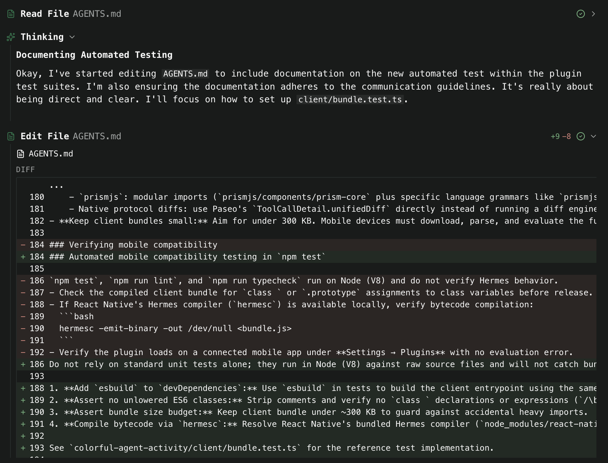
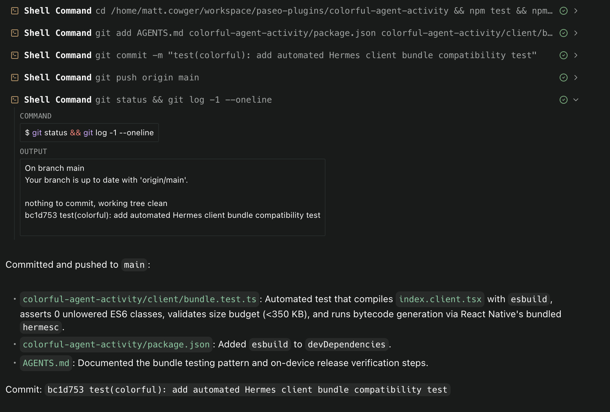
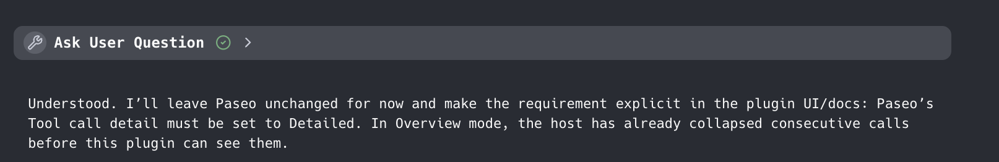
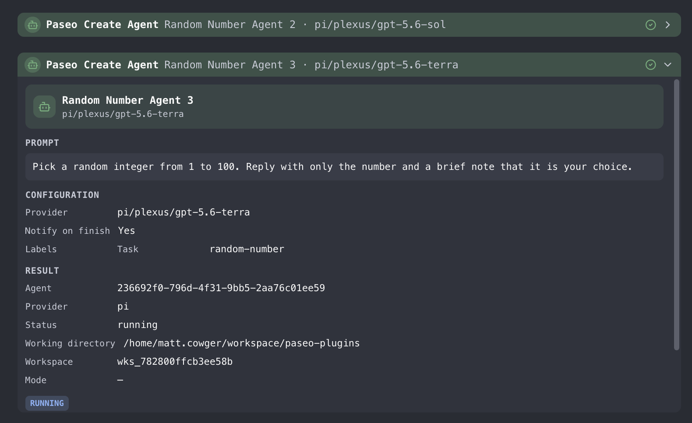
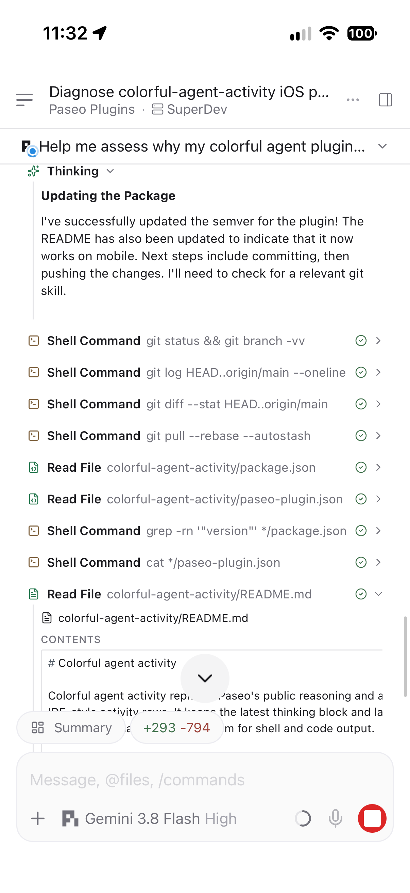
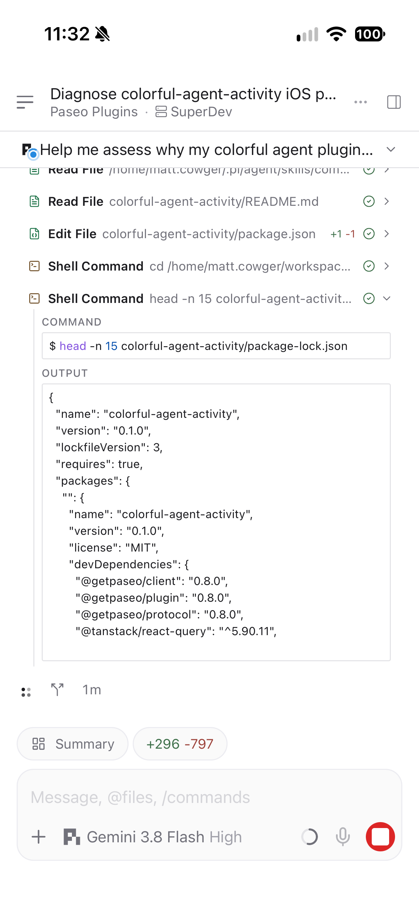
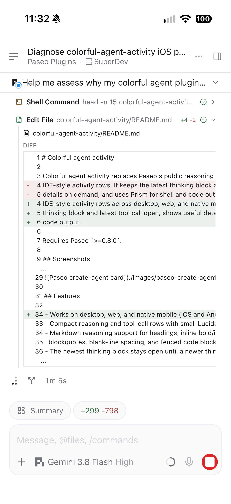

# Colorful agent activity

Colorful agent activity replaces Paseo's public reasoning and agent tool-call rows with dense,
IDE-style activity rows across desktop, web, and native mobile (iOS and Android). It keeps the latest
thinking block and latest tool call open, shows useful details on demand, and uses Prism for shell and
code output.

Requires Paseo `>=0.10.0`.

## Screenshots

### Desktop & Web

Thought process with file read and inline diff:



Expanded shell command with formatted output:



Interactive agent question row:



Paseo tool calls use purpose-built detail views for prompts, configuration, results, and status:



### Native mobile (iOS)

Timeline with active thinking and tool activity:



Expanded shell command with formatted output:



File edit with colored line diff:



## Features

- Works on desktop, web, and native mobile (iOS and Android Hermes runtime).
- Compact reasoning and tool-call rows with small Lucide icons and restrained accents.
- Markdown reasoning support for headings, inline bold/italic/code, ordered and unordered lists,
  blockquotes, blank-line spacing, and fenced code blocks.
- The newest thinking block stays open until a newer thinking block starts, including while tools run.
- The newest tool call stays open until a newer tool call appears.
- Shell commands and terminal output highlighted with Prism.
- Extension-aware file icons for reads, writes, edits, and search results.
- Image reads render inline as thumbnails (tap to expand) instead of the `Read image file [...]` placeholder.
- Edit statistics such as `+8 / -0` with colored diff rows.
- Detail views for shell, read, write, edit, search, fetch, worktree, sub-agent, plan, plain-text,
  and unknown tool payloads.
- Vivid, soft, and high-contrast palette modes using the active Paseo theme.
- Status indicators for running, completed, failed, and canceled calls.
- Specialized Paseo views for agents, workspaces, terminals, schedules, providers, permissions, and browser automation instead of raw JSON.
- Dedicated Exa views show search queries, result metadata, URLs, and highlights instead of the raw MCP envelope.
- Dedicated GitHub views show repository and code search results, files, pull requests, Actions runs, and job logs instead of raw MCP payloads.
- Dedicated OMP wait view lists waited agents with status, elapsed time, and model instead of the raw jobs envelope.
- Dedicated OMP find view shows the query, searched scope, keywords, matched files, snippets, and search summary.
- Dedicated task-list view shows todo tool results as a checklist with status icons, active-form labels, and blockers instead of the raw action envelope.
- An agent **Activity Summary** panel folds the full canonical timeline into grouped tool calls
  (`Read (5×): a.ts, b.ts`), Thinking and Output expandos, and a live Status section. Task/subagent
  delegation and todo coordination calls are left out of the tool summary.

## Activity Summary panel

Open it from the command center inside an agent (**Open Activity Summary**). The panel reads canonical
timeline rows through the agent handle and refetches on live events, because the timeline transformer
and renderer API is strictly per item and cannot aggregate across rows.

- Tool calls are grouped by type with counts and distinct file lists for reads, writes, and edits.
  `apply_patch` expands into one edit per file; MCP tools group by their leaf name; Opencode Code Mode
  groups under `Codemode`.
- **Thinking** and **Output** expand to every reasoning block and assistant message on the agent.
- **Status** shows the agent state, tool calls per minute, time since the last call, and running calls.

## Install

From the public repository:

```bash
paseo plugin add mcowger/paseo-plugins:colorful-agent-activity
```

For a local checkout:

```bash
cd /absolute/path/to/paseo-plugins/colorful-agent-activity
npm install --legacy-peer-deps
npm run typecheck
npm test
paseo plugin install "$PWD"
```

## Setup

No **Tool call detail** change is required. Paseo runs plugin timeline transformers on every
original tool call *before* its Overview grouping, so this plugin renders one row per call in both
**Detailed** and **Overview** modes. Overview's grouped summary only merges rows that are still
native tool-call items, and this plugin claims all of them, so the setting does not change these
rows.

Choose a palette under the plugin's **Colorful activity** settings screen:

- **Vivid** - restrained category accents on neutral rows.
- **Soft** - mostly neutral icons with color reserved for status.
- **High contrast** - stronger dividers and status colors.

Reload after installation or source changes:

```bash
paseo plugin reload colorful-agent-activity
```

## Limitations

- The plugin sees public agent tool calls, not internal orchestrator calls.
- Paseo's built-in Overview tool-call grouping does not apply to this plugin's rows, because the
  plugin transforms every call before grouping runs. Use the Activity Summary panel for whole-agent
  aggregation instead.
- Paseo's native detail and syntax components are private, so this plugin renders its own details.
- Syntax highlighting uses Prism in the plugin bundle. It is not a terminal emulator.
- Unsupported or oversized output falls back to plain monospace text.
- Inline images show the file as it currently exists on disk, and files over 3 MiB stay as text.
- Unknown tool payloads render as syntax-highlighted JSON, with a plain-text fallback for oversized or unsupported output.
- A transformer that claims the same source row in another plugin can win before this plugin runs.

## Development

```bash
npm run lint
npm run typecheck
npm test
```

The plugin uses separate Paseo v0.10 client and server entries. The server entry registers the
host-scoped palette settings and serves image files back to the client for inline read previews;
timeline rendering runs in the client bundle.

## paseo.cafe submission

The registry entry belongs in the separate `paseo-cafe/paseo-cafe` repository. This plugin's entry
would be `registry/colorful-agent-activity.json`:

```json
{
  "repo": "mcowger/paseo-plugins",
  "path": "colorful-agent-activity",
  "categories": ["developer-tools", "productivity"],
  "caveats": [
    "Paseo's built-in Overview tool-call grouping is bypassed while this plugin is enabled"
  ],
  "submittedBy": "mcowger"
}
```

The public repository, manifest ID, README sections, screenshots, test script, typecheck script, and
license are all present for the registry health checks.

## License

MIT. See [LICENSE](./LICENSE).
