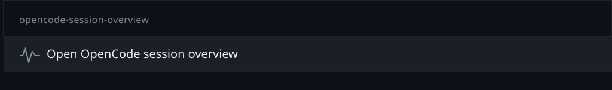
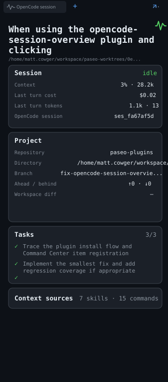

# OpenCode session overview

This read-only Paseo plugin adds an agent-scoped activity pane for OpenCode agents. It uses the
public Paseo `0.8.0-beta.1` agent SDK to show the native OpenCode session ID, current usage,
context window, tasks, loaded skills/commands, workspace metadata, and observed subagents.

The panel does not connect directly to OpenCode, start a server, or expose provider credentials.
It uses Paseo's normalized agent and timeline APIs, so it follows the OpenCode process and session
lifecycle already managed by Paseo.

## Screenshots

Find the pane from the Command Center:



The activity pane shows the current OpenCode session and workspace details:



## Install

The plugin targets Paseo `v0.8.0-beta.1` and requires an OpenCode agent in Paseo.

```bash
cd /absolute/path/to/opencode-session-overview
npm install
paseo plugin install "$PWD"
paseo plugin reload opencode-session-overview
```

## Enable from the Command Center

1. Open an OpenCode agent in Paseo.
2. Open the **Command Center**.
3. Search for `opencode-session-overview`.
4. Select **Open OpenCode session overview**.

The pane is also available as **OpenCode session** in the workspace and explorer panel locations.
After updating the plugin, run `paseo plugin reload opencode-session-overview` to load the changes.

Usage and context costs are based on the latest usage snapshot provided by Paseo. They are not
presented as lifetime billing totals when the provider has not supplied those values.

## Development

```bash
npm run lint
npm run typecheck
npm test
```
