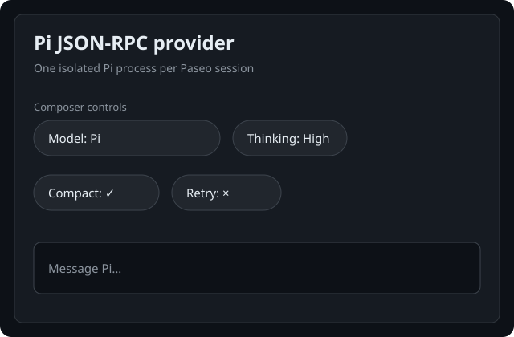

# Pi provider (mcowger)

`pi-plugin-mcowger` is a Paseo provider for the
[pi coding agent](https://github.com/earendil-works/pi). It targets Paseo
`v0.8.0` and embeds pi through `@earendil-works/pi-coding-agent` instead of
running the `pi` CLI in RPC mode.

## Status

The plugin targets Paseo `v0.8.0`. Paseo's provider API is stable for this release.

## Preview



## What it does

- Loads pi models, auth, settings, extensions, skills, and prompt templates from `~/.pi/agent`.
- Exposes pi models with per-model thinking levels in Paseo's composer.
- Exposes `presets.json` entries as composer modes. Selecting a preset applies its model, thinking
  level, tools, and prompt instructions.
- Emits `@juicesharp/rpiv-todo` results as native Paseo todo items.
- Maps foreground pi subagent calls to native Paseo subagent tool rows.
- Bridges pi extension dialogs to Paseo permission questions.
- Bridges Paseo-provided MCP servers to pi custom tools in-process.
- Persists sessions with pi's `SessionManager` and supports replay from the active branch, steering,
  interruption, compaction, usage reporting, conversation rewind, and Paseo chat-history forks.

## Installation

Install from a checkout of this repository:

```bash
cd /absolute/path/to/pi-plugin-mcowger
npm install
npm run typecheck
paseo plugin install "$PWD"
paseo plugin reload pi-plugin-mcowger
```

`npm install` patches broken declaration probes in third-party dependencies and builds the vendored
pi/MCP SDK bundle required by Paseo's plugin compiler. See
[`docs/packaging.md`](./docs/packaging.md) for the details.

## Pi configuration

The plugin uses pi's normal configuration directory, including:

- `~/.pi/agent/settings.json`
- `~/.pi/agent/auth.json`
- `~/.pi/agent/presets.json`
- `~/.pi/agent/extensions/`
- `~/.pi/agent/packages`

Project-local `.pi` settings and resources are loaded for the active workspace.

## Development

```bash
npm run build:vendor
npm run lint
npm run typecheck
npm test
npx vitest run --config vitest.smoke.config.ts
```

Set `PI_SMOKE_MODEL` to override the smoke-test model. The default is
`plexus/gemini-3.5-flash-lite`.
