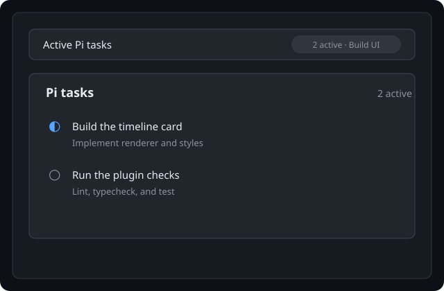

# Pi tasks timeline

`pi-tasks-timeline` keeps Pi task lists visible in Paseo. It targets Paseo `v0.8.0` and recognizes completed `todo` tool calls,
turns them into task-list timeline items, and preserves the task state across the agent's projected
timeline history.

## What it does

- Replaces supported Pi `todo` tool-call rows with a readable task list in the timeline.
- Preserves pending, in-progress, and completed tasks. Deleted task tombstones are omitted.
- Adds an **Active Pi tasks** panel to the workspace and explorer agent surfaces.
- Shows a Paseo 0.8 composer pill while active tasks exist, including the active-task count and current task.
- Opens the active tasks in a host-rendered popover from the pill.
- Refreshes from projected timeline history when task updates arrive and while the agent is running
  or has active tasks.

If a tool call is unrelated, malformed, empty, or uses an unsupported task shape, Paseo's original
timeline entry is left unchanged.

## Preview



## Limitations

The plugin only recognizes completed `todo` tool-call results in the supported `details.tasks` or
`details.todos` shapes. Other task producers leave the original timeline entry unchanged.

## Installation

Install the plugin from a checkout of this repository:

```bash
cd /absolute/path/to/pi-tasks-timeline
npm install
npm run typecheck
paseo plugin install "$PWD"
paseo plugin reload pi-tasks-timeline
```

After installing a compatible Pi todo plugin, create or update tasks through Pi's `todo` tool. The
task list will appear in the agent timeline and the active-task pill will appear when tasks are
pending or in progress.

## Compatible Pi plugins

The plugin currently supports these task producers:

- [`@juicesharp/rpiv-todo`](https://github.com/juicesharp/rpiv-todo), using `details.tasks` with
  `id`, `subject`, `activeForm`, and `status` fields.
- Pi's [`examples/extensions/todo.ts`](https://github.com/badlogic/pi-mono/blob/main/packages/coding-agent/examples/extensions/todo.ts),
  using `details.todos` with `id`, `text`, and `done` fields.

Compatibility is based on the completed `todo` tool-call result shape. Other Pi todo plugins can
work if they emit one of these supported `details.tasks` or `details.todos` shapes.

## Development

```bash
npm run lint
npm run typecheck
npm test
```
