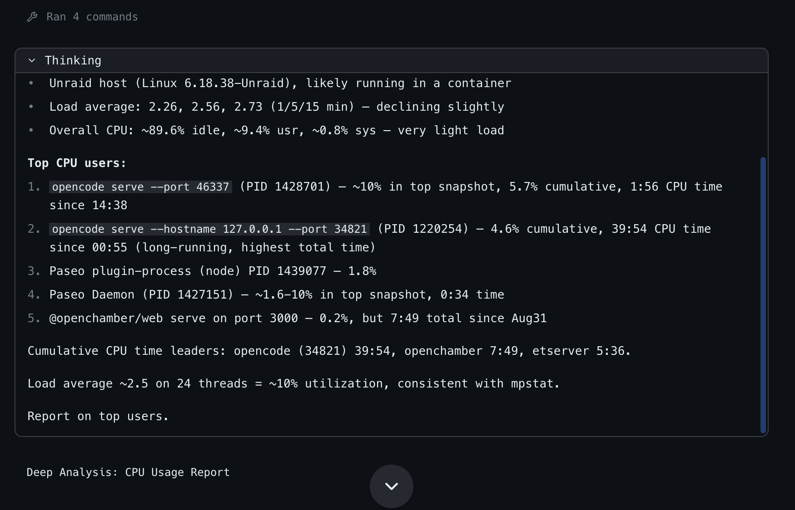

# Reasoning display

This Paseo plugin targets Paseo `v0.8.0-beta.1` and replaces built-in agent reasoning blocks with an expandable Markdown renderer matching Paseo's native tool-call cards.

## Features

- **Paced streaming**: Renders thinking text smoothly as it streams using `@getpaseo/plugin/client/react-native`'s `useRevealedText`.
- **Collapsible timeline cards**: Seamlessly toggle thinking blocks open or closed with matching monospace typography and attached container styling.
- **Three display modes**:
  - **Expand last** (default) — only the newest reasoning block starts expanded; previous blocks automatically stay collapsed.
  - **Collapsed** — all reasoning blocks start collapsed.
  - **Always expand** — every reasoning block starts fully expanded.
- **Persistent configuration**: Settings are managed via the **Reasoning Display** sidebar surface and persisted in `$PASEO_HOME/plugin-data/reasoning-display.json`.
- **Developer diagnostics**: Includes an optional debug toggle to log timeline render ticks, phase transitions, and state updates to the console for troubleshooting.

## Screenshot

The **Reasoning Display** settings surface lets you configure timeline expansion behavior and diagnostics:



## Install

```bash
cd /absolute/path/to/reasoning-display
npm install
npm run typecheck
paseo plugin install "$PWD"
paseo plugin reload reasoning-display
```

## Settings

1. In the Paseo sidebar, click the **Brain icon** (**Reasoning Display**).
2. Choose your preferred **Display mode** from the dropdown:
   - **Expand last**
   - **Collapsed**
   - **Always expand**
3. Optionally toggle **Debug logging** under **Diagnostics** to enable verbose console logging.

## Limitations

The plugin replaces Paseo's reasoning rows only while its timeline transformer is loaded. It does
not recover reasoning text that the provider never sends.

## Development

```bash
npm run lint
npm run typecheck
npm test
```
