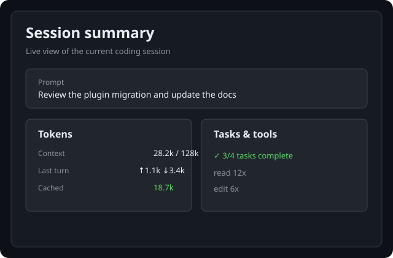

# Session summary

This Paseo `v0.8.0-beta.1` plugin adds an agent-scoped live summary panel for reviewing a coding session.
It uses Paseo's normalized agent and timeline APIs and does not connect directly to provider
processes or expose provider credentials.

## Features

- **Prompt review**: Shows the initial user prompt with a collapsible preview and full Markdown view.
- **Session context**: Shows context size and the latest observed token counts in a compact statistics row.
- **Task progress**: Displays pending, in-progress, and completed tasks from native Todo, plan, and supported tool updates.
- **Tool activity**: Summarizes tool-call counts and shows recent compact tool-call details.
- **Thoughts and outcome**: Groups adjacent reasoning deltas, shows a compact latest-thought preview, and keeps the full Thought Log and outcome in Details.
- **Mobile overview**: Keeps the prompt, statistics, tasks, latest thought, and recent tools visible on compact layouts.
- **Access points**: Available from the **Summary** workspace/explorer panel, the `/summary` slash command, and the **Summary** composer pill.

## Preview



## Limitations

The summary uses the timeline and usage data exposed by Paseo. Provider-specific fields are only
shown when the provider reports them, and older history is capped to keep the panel responsive.

## Install

The plugin targets Paseo `v0.8.0-beta.1`.

```bash
cd /absolute/path/to/paseo-plugins
npm run sdk:install -- --plugin session-summary
cd session-summary
npm run typecheck
paseo plugin install "$PWD"
paseo plugin reload session-summary
```

## Open the summary

1. Open an agent in Paseo.
2. Open the **Summary** panel from the workspace or explorer panel locations.
3. Alternatively, type `/summary` in the agent composer or press the **Summary** composer pill.

After updating the plugin, run `paseo plugin reload session-summary` to load the changes.

## Development

```bash
npm run lint
npm run typecheck
npm test
```
