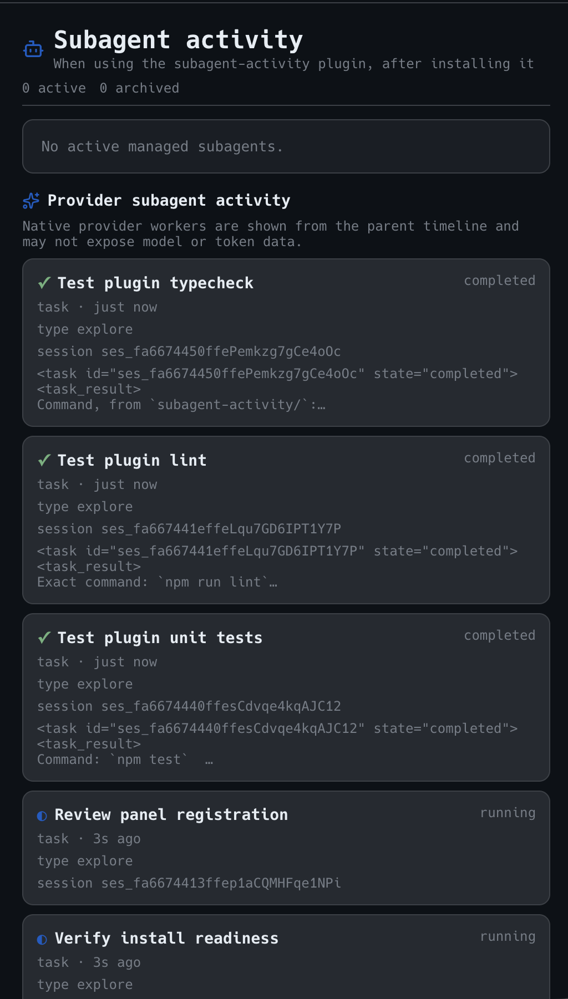

# Subagent activity

This Paseo `v0.7.0-beta.2` plugin adds an agent-scoped activity pane for monitoring managed Paseo
descendants and provider-native subagent activity.

The panel displays:

- active and archived managed child agents, including nested descendants;
- provider, model, lifecycle status, last activity, and provider-reported usage;
- the ten most recent tool calls for each managed child;
- best-effort provider-native subagent activity exposed by the parent timeline.

Provider-native activity is intentionally labeled separately because Paseo beta.2 does not expose a stable plugin-facing native-child registry. Native rows therefore do not claim model, token, or independent lifecycle data that the timeline does not provide.

## Screenshot

The activity pane shows managed descendants and provider-native activity observed in the parent timeline:



## Install

The plugin targets Paseo `v0.7.0-beta.2`.

```bash
cd /absolute/path/to/subagent-activity
npm install
paseo plugin install "$PWD"
paseo plugin reload subagent-activity
```

## Enable from the Command Center

1. Open an agent in Paseo.
2. Open the **Command Center**.
3. Search for `subagent-activity`.
4. Select **Open subagent activity**.

The pane is also available as **Subagent activity** in the workspace and explorer panel locations.
After updating the plugin, run `paseo plugin reload subagent-activity` to load the changes.

## Development

```bash
npm run lint
npm run typecheck
npm test
```
