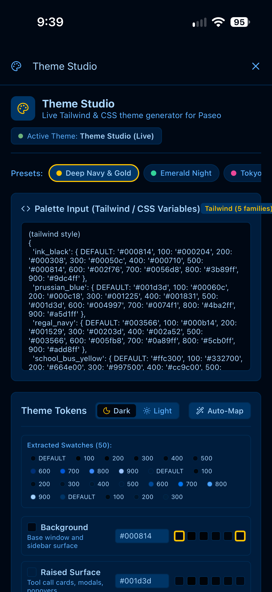
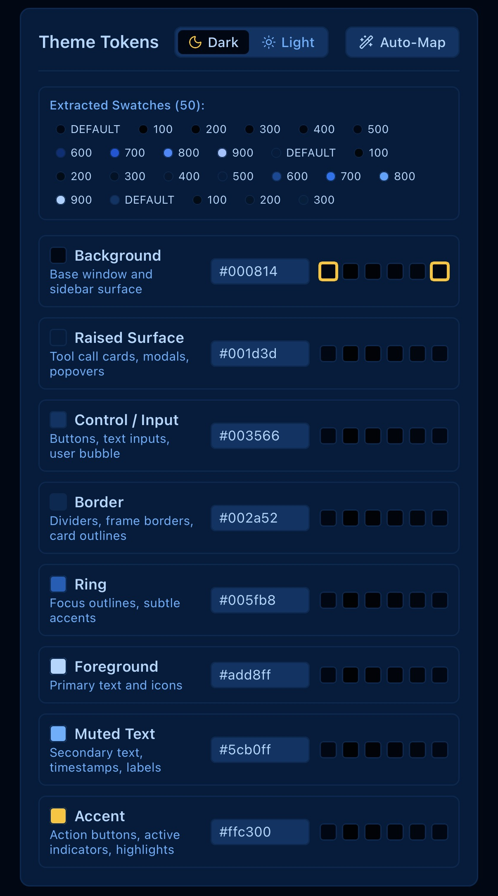
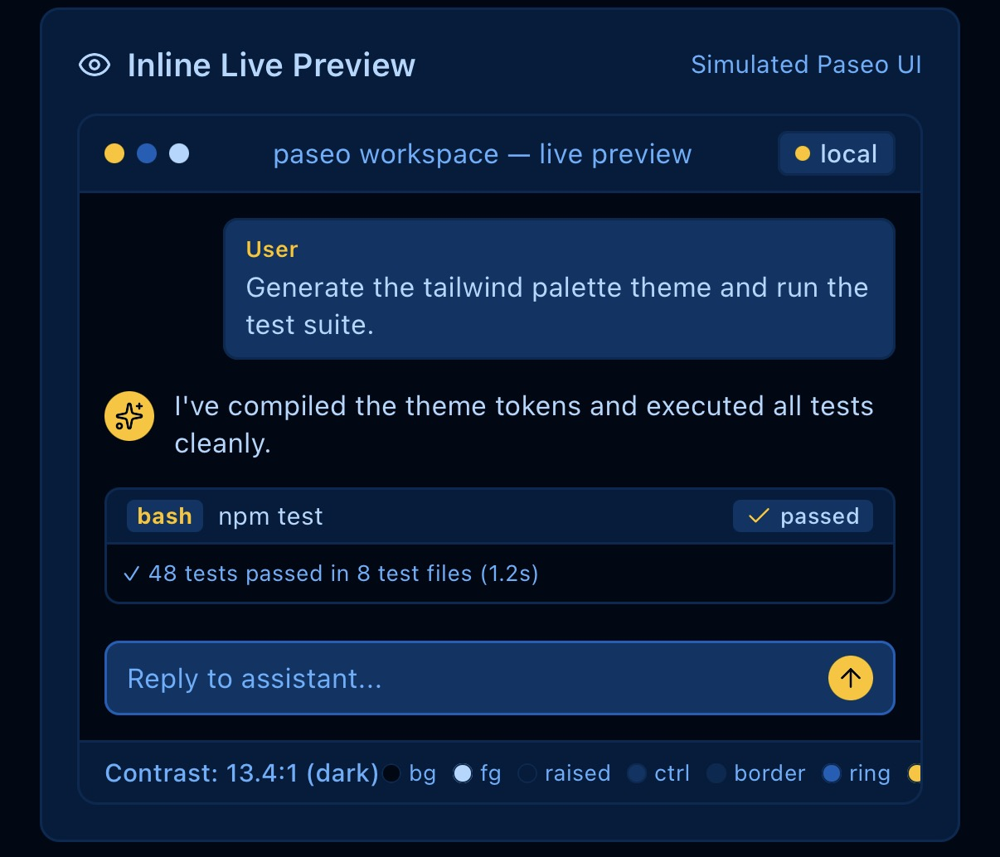
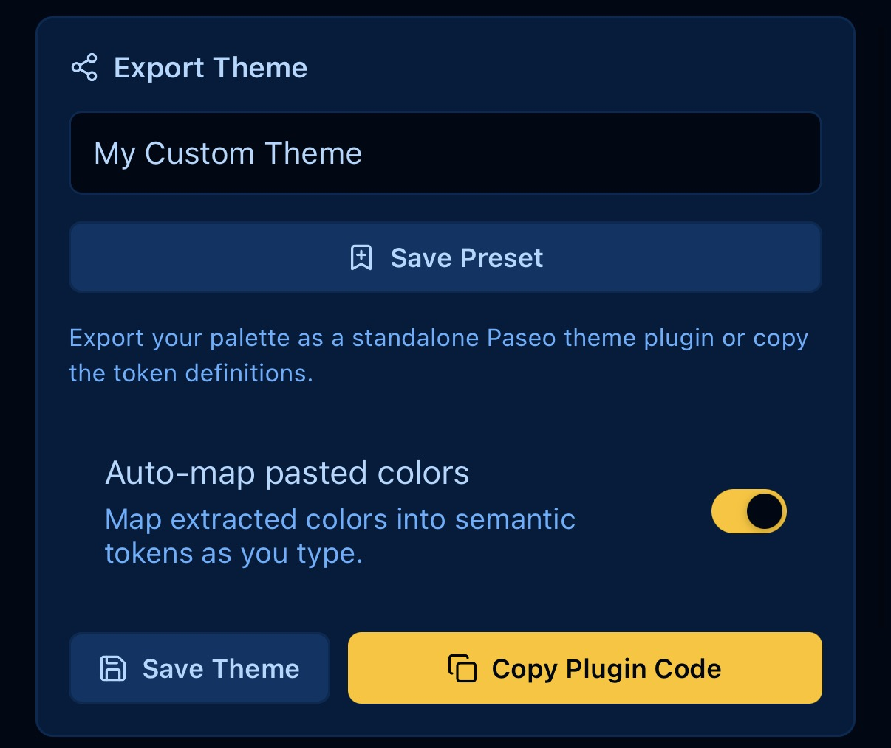
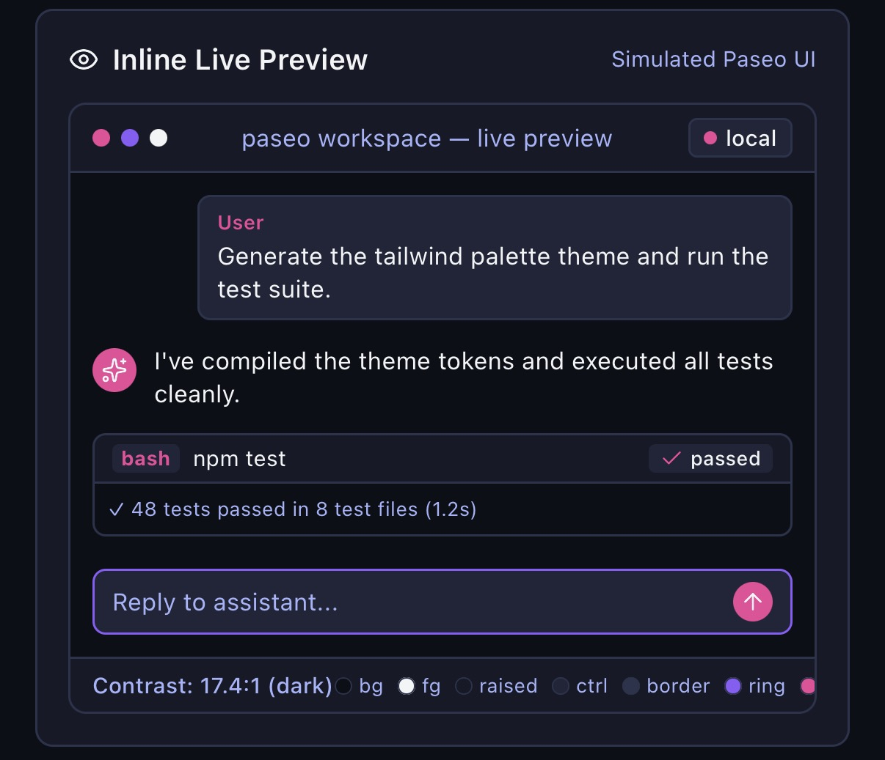
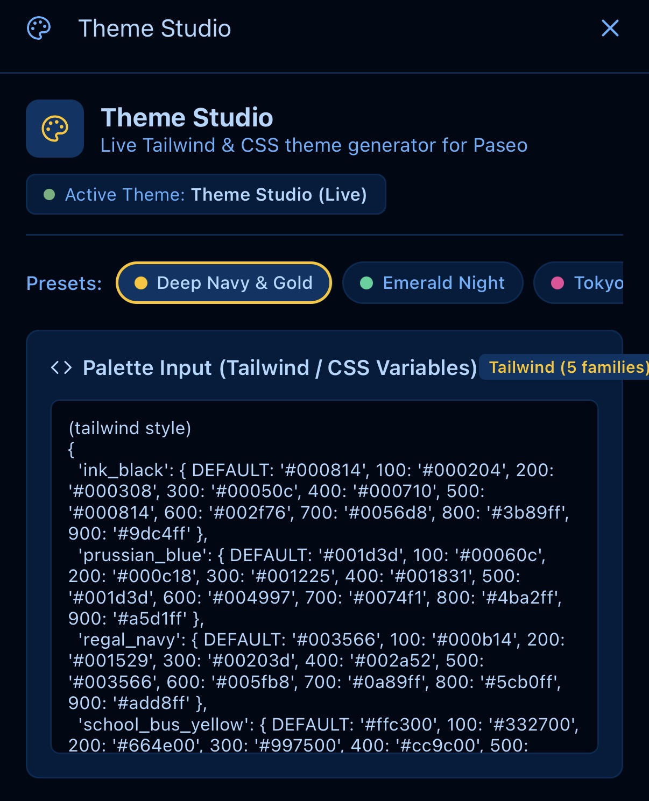

# Theme Studio

Theme Studio is an interactive, live theme designer and palette playground for [Paseo](https://paseo.sh/).

Enter Tailwind color objects, CSS custom variables, or raw hex palettes, map colors to Paseo semantic tokens, inspect changes in real time via an inline mini-preview, and instantly re-skin the host Paseo app live.

Requires Paseo `>=0.9.0`.

## Screenshots

Theme Studio live preview with passing test results:



Theme Studio's export screen with preset saving and plugin-code copying:



Dark-mode theme token editor:



Live preview with contrast tests and token results:



Deep Navy & Gold theme editor:



Tailwind and CSS palette editing:



## Features

- **Multi-Format Palette Parser**:
  - **Tailwind style objects**:
    ```js
    {
      'ink_black': { DEFAULT: '#000814', 100: '#000204', ..., 900: '#9dc4ff' },
      'school_bus_yellow': { DEFAULT: '#ffc300', ..., 900: '#fff3cc' }
    }
    ```
  - **CSS custom properties**:
    ```css
    --ink-black: #000814ff;
    --prussian-blue: #001d3dff;
    --regal-navy: #003566ff;
    --school-bus-yellow: #ffc300ff;
    --gold: #ffd60aff;
    ```
  - **Raw hex lists & JSON**.
- **Real-Time Host Theme Re-Skinning**:
  - Automatically updates the contributed `Theme Studio (Live)` theme in Paseo's theme catalog as you type and tweak shades.
  - No app reload or daemon restart required.
- **Inline Simulated Paseo Mini-Preview**:
  - Live mockup rendered with active theme tokens: sidebar navigation, active agent status, user & assistant chat bubbles, bash tool-call cards with output, composer bar, and contrast ratio calculation.
- **Auto-Mapping Algorithm**:
  - Automatically arranges extracted shades into Paseo's 8 semantic slots (`background`, `raised`, `control`, `border`, `ring`, `foreground`, `mutedForeground`, `accent`) based on luminance and saturation curves.
- **Standalone Export**:
  - Copy full ready-to-use TypeScript plugin code (`client.addTheme({...})`) with one click to package your custom theme permanently.

## Install

From the public repository:

```bash
paseo plugin add mcowger/paseo-plugins:theme-studio
```

For a local checkout:

```bash
cd /absolute/path/to/paseo-plugins/theme-studio
npm install --legacy-peer-deps
npm run typecheck
npm test
paseo plugin install "$PWD"
```

## Setup

1. Open **Theme Studio** from the sidebar or via Command Center (`⌘K` → `Open Theme Studio`).
2. Navigate to Paseo's **Settings → Appearance**.
3. Select **Theme Studio (Live)**.
4. Any edits in Theme Studio will immediately update the entire Paseo interface.

Reload after installation or source changes:

```bash
paseo plugin reload theme-studio
```

## Limitations

- The live theme resets to the last saved preset when Paseo restarts.
- Not a full IDE for syntax-highlighting token changes (Paseo's `syntaxTheme` setting remains separate from app themes).

## Development

```bash
npm run lint
npm run typecheck
npm test
```

The plugin uses separate Paseo v0.9 client and server entries. The server entry only registers the host-scoped settings; the live theme controller, parsing, and UI all run in the client bundle.

## paseo.cafe submission

This plugin's entry would be `registry/theme-studio.json`:

```json
{
  "repo": "mcowger/paseo-plugins",
  "path": "theme-studio",
  "categories": ["developer-tools"],
  "caveats": [],
  "submittedBy": "mcowger"
}
```

## License

MIT. See [LICENSE](./LICENSE).
